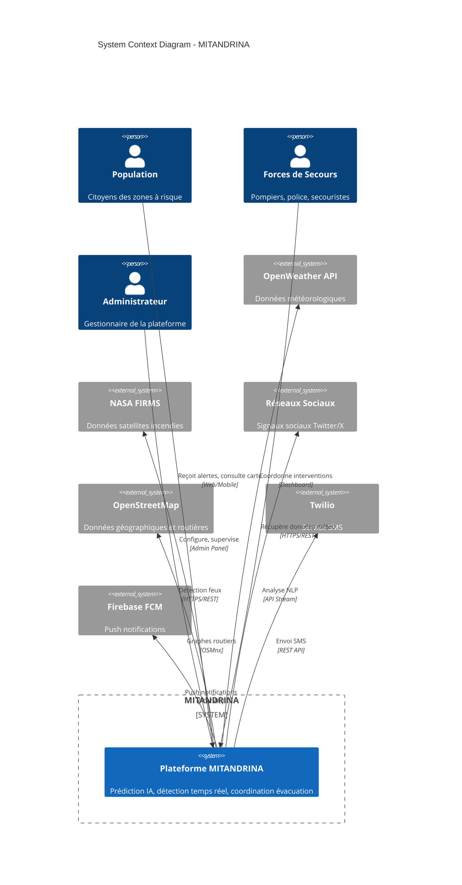
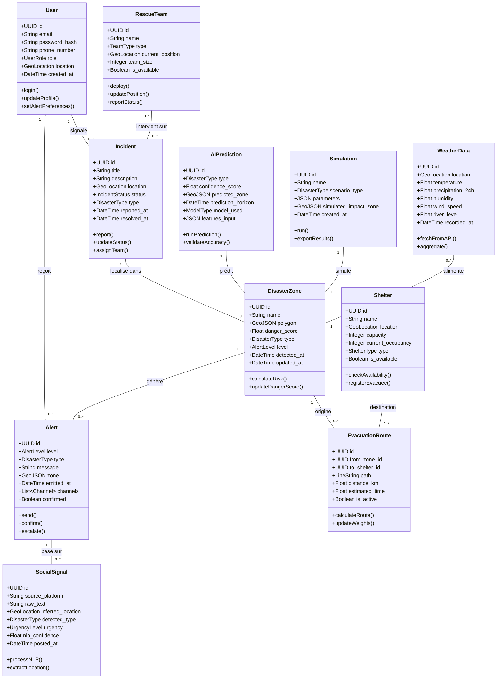
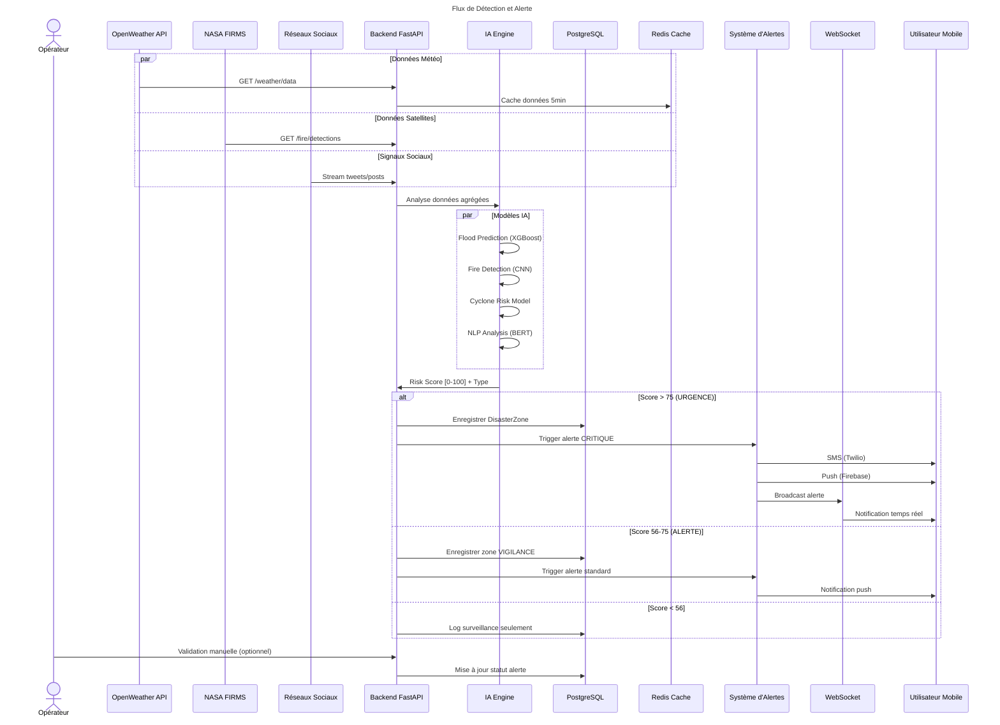
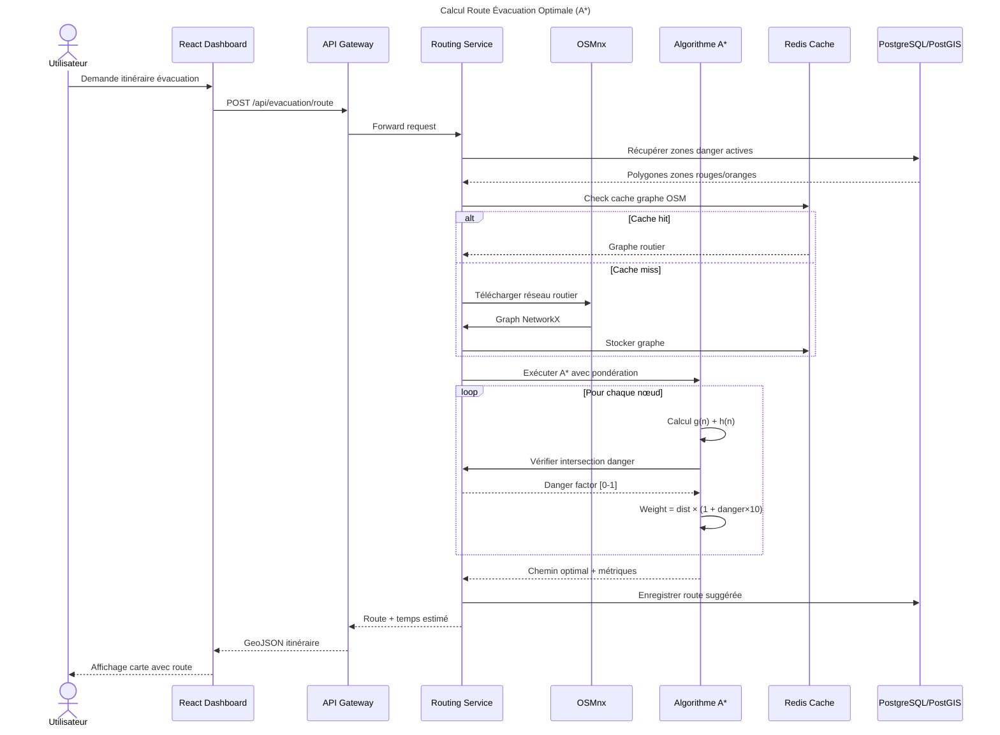
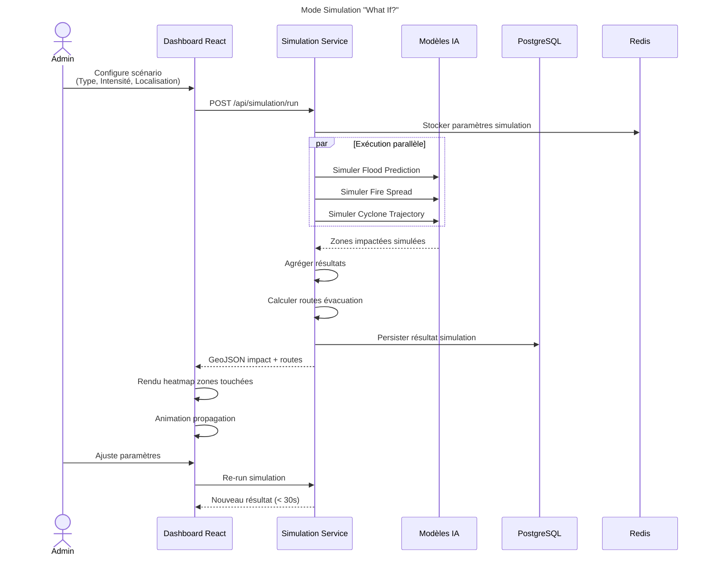
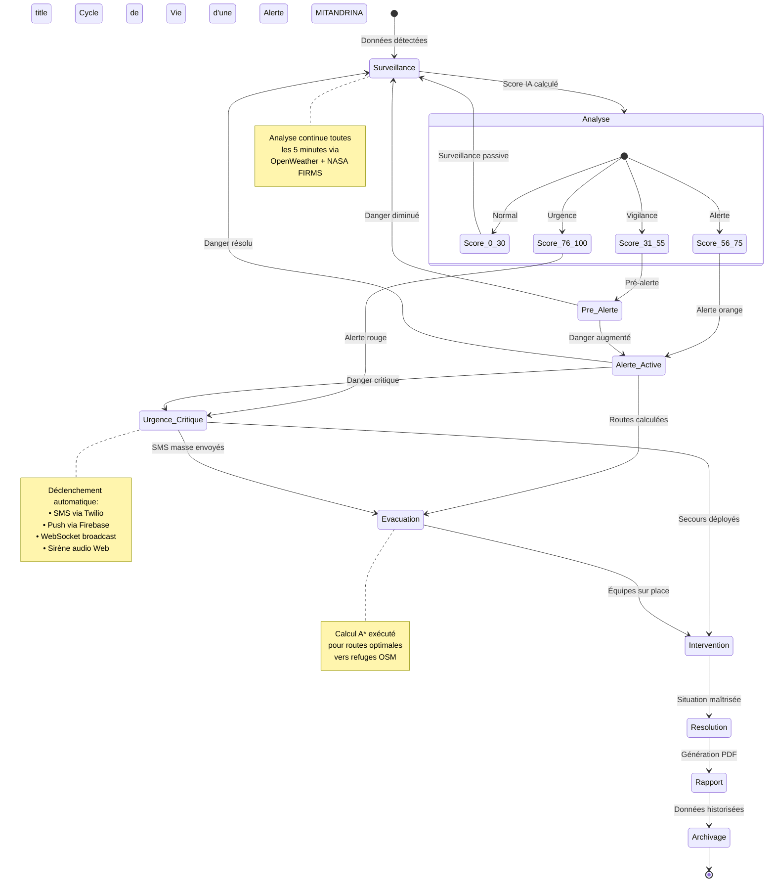

# 🌪️ MITANDRINA — UML Complet

**Plateforme IA de Prédiction, Détection et Coordination des Catastrophes Naturelles**

---

## 📋 Table des matières

1. [Diagramme de Contexte (C4)](#1-diagramme-de-contexte-c4)
2. [Diagramme de Cas d'Utilisation](#2-diagramme-de-cas-dutilisation)
3. [Diagramme de Classes](#3-diagramme-de-classes)
4. [Diagrammes de Séquence](#4-diagrammes-de-séquence)
5. [Diagramme de Composants](#5-diagramme-de-composants)
6. [Diagramme de Déploiement](#6-diagramme-de-déploiement)
7. [Diagramme d'Activité — Algorithme A*](#7-diagramme-dactivité--algorithme-a)
8. [Diagramme d'État — Cycle d'Alerte](#8-diagramme-détat--cycle-dalerte)

---

## 1. Diagramme de Contexte (C4)



---

## 2. Diagramme de Cas d'Utilisation

```mermaid
usecaseDiagram
    title Diagramme de Cas d'Utilisation - MITANDRINA
    
    left {
        actor "Population Civile" as Population
        actor "Forces de Secours" as Secours
        actor "Administrateur" as Admin
    }
    
    package "MITANDRINA Platform" {
        usecase "Visualiser Carte des Risques" as UC1
        usecase "Recevoir Alertes Multicanal" as UC2
        usecase "Consulter Itinéraire Évacuation" as UC3
        usecase "Signaler Incident" as UC4
        
        usecase "Superviser Incidents Temps Réel" as UC5
        usecase "Coordonner Équipes de Secours" as UC6
        usecase "Générer Rapport Post-Crise" as UC7
        usecase "Valider/Modifier Alertes" as UC8
        
        usecase "Configurer Seuils d'Alerte" as UC9
        usecase "Gérer Utilisateurs" as UC10
        usecase "Simuler Scénario \"What If?\"" as UC11
        usecase "Consulter KPI et Métriques" as UC12
        
        usecase "Prédire Catastrophe (IA)" as UC13
        usecase "Détecter Incendie (CNN)" as UC14
        usecase "Analyser Signaux Sociaux (NLP)" as UC15
        usecase "Calculer Route Évacuation (A*)" as UC16
    }
    
    Population --> UC1
    Population --> UC2
    Population --> UC3
    Population --> UC4
    
    Secours --> UC5
    Secours --> UC6
    Secours --> UC7
    Secours --> UC8
    
    Admin --> UC9
    Admin --> UC10
    Admin --> UC11
    Admin --> UC12
    
    UC13 ..> UC2 : <<include>>
    UC14 ..> UC2 : <<include>>
    UC15 ..> UC2 : <<include>>
    UC16 ..> UC3 : <<include>>
    
    UC6 ..> UC5 : <<include>>
    UC8 ..> UC2 : <<extend>>
```

---

## 3. Diagramme de Classes



---

## 4. Diagrammes de Séquence

### 4.1 Détection et Alerte Catastrophe (Flux Principal)



### 4.2 Calcul d'Itinéraire d'Évacuation



### 4.3 Simulation "What If?"



---

## 5. Diagramme de Composants

```mermaid
graph TB
    title Diagramme de Composants - Architecture MITANDRINA
    
    subgraph Client_Layer["**CLIENT LAYER**"]
        WebApp["🌐 Dashboard React<br/>Next.js 14 + Tailwind"]
        Mobile["📱 PWA Mobile<br/>Responsive + Offline"]
    end
    
    subgraph API_Gateway_Layer["**API GATEWAY LAYER**"]
        Gateway["🛡️ API Gateway<br/>Express.js + Rate Limiting"]
        Auth["🔐 Auth Service<br/>JWT + Middleware"]
        WebSocket_Server["⚡ WebSocket Server<br/>Socket.io"]
    end
    
    subgraph AI_Layer["**AI ENGINE LAYER**"]
        Flood_AI["🌊 Flood Prediction<br/>XGBoost + LSTM"]
        Fire_AI["🔥 Fire Detection<br/>CNN ResNet-50"]
        Cyclone_AI["🌀 Cyclone Risk<br/>Ridge Regression"]
        NLP_AI["💬 Social NLP<br/>BERT Multilingue"]
    end
    
    subgraph Core_Services_Layer["**CORE SERVICES LAYER**"]
        Decision_Engine["🧠 Decision Engine<br/>Risk Aggregation"]
        Routing_Service["🗺️ Routing Service<br/>A* + OSMnx"]
        Alert_Service["📢 Alert Service<br/>Multi-canal"]
        Simulation_Service["🔮 Simulation Service<br/>What If?"]
    end
    
    subgraph Data_Layer["**DATA LAYER**"]
        PostgreSQL[("🗄️ PostgreSQL<br/>+ PostGIS")]
        Redis[("⚡ Redis Cache<br/>Sessions + Météo")]
        BullQueue["📋 Bull Queue<br/>Traitement async")]
    end
    
    subgraph External_Integrations["**EXTERNAL INTEGRATIONS**"]
        OpenWeather["🌤️ OpenWeather API"]
        NASA["🛰️ NASA FIRMS"]
        Twilio["📲 Twilio SMS"]
        Firebase["🔔 Firebase FCM"]
        OSM["🗺️ OpenStreetMap"]
    end
    
    WebApp --> Gateway
    Mobile --> Gateway
    
    Gateway --> Auth
    Gateway --> WebSocket_Server
    
    Gateway --> Flood_AI
    Gateway --> Fire_AI
    Gateway --> Cyclone_AI
    Gateway --> NLP_AI
    
    Flood_AI --> Decision_Engine
    Fire_AI --> Decision_Engine
    Cyclone_AI --> Decision_Engine
    NLP_AI --> Decision_Engine
    
    Decision_Engine --> Alert_Service
    Decision_Engine --> Routing_Service
    
    Alert_Service --> BullQueue
    Routing_Service --> OSM
    
    Gateway --> Simulation_Service
    
    Gateway --> PostgreSQL
    Decision_Engine --> PostgreSQL
    Routing_Service --> PostgreSQL
    
    Gateway --> Redis
    Alert_Service --> Redis
    
    Gateway --> OpenWeather
    Gateway --> NASA
    Alert_Service --> Twilio
    Alert_Service --> Firebase
    Routing_Service --> OSM
    
    WebSocket_Server --> WebApp
    WebSocket_Server --> Mobile
```

---

## 6. Diagramme de Déploiement

```mermaid
graph TB
    title Diagramme de Déploiement - Infrastructure MITANDRINA
    
    subgraph Internet["**🌐 INTERNET**"]
        Users["Utilisateurs<br/>(Web/Mobile)"]
    end
    
    subgraph CDN_Layer["**CDN / EDGE**"]
        Vercel_EDGE["Vercel Edge Network<br/>Static Assets + SSR"]
    end
    
    subgraph Vercel_Platform["**VERCEL PLATFORM**"]
        NextJS["Next.js 14 App<br/>Frontend + API Routes"]
    end
    
    subgraph Railway_Platform["**RAILWAY / CLOUD**"]
        subgraph Backend_Services["Backend Services"]
            API_Gateway["API Gateway<br/>Node.js + Express"]
            AI_Services["AI Services<br/>Python FastAPI"]
            WebSocket_Node["WebSocket Server<br/>Socket.io"]
        end
        
        subgraph Data_Storage["Data Layer"]
            PostgreSQL[("PostgreSQL<br/>PostGIS Extension")]
            Redis[("Redis<br/>Cache + Pub/Sub")]
        end
        
        subgraph Workers["Async Workers"]
            Bull_Worker["Bull Queue Workers<br/>Alert Processing"]
            ML_Inference["ML Inference<br/>Model Serving"]
        end
    end
    
    subgraph External_APIs["**EXTERNAL APIs**"]
        OpenWeather["OpenWeather<br/>api.openweathermap.org"]
        NASA["NASA FIRMS<br/>firms.modaps.eosdis.nasa.gov"]
        Twilio["Twilio SMS<br/>api.twilio.com"]
        Firebase["Firebase FCM<br/>fcm.googleapis.com"]
        OSM["OpenStreetMap<br/>openstreetmap.org"]
    end
    
    subgraph DevOps_Tools["**DEVOPS**"]
        Docker["Docker<br/>Containers"]
        GitHub["GitHub<br/>CI/CD Actions"]
    end
    
    Users --> Vercel_EDGE
    Vercel_EDGE --> NextJS
    NextJS --> API_Gateway
    
    API_Gateway --> AI_Services
    API_Gateway --> WebSocket_Node
    
    API_Gateway --> PostgreSQL
    API_Gateway --> Redis
    AI_Services --> PostgreSQL
    
    Redis --> Bull_Worker
    AI_Services --> ML_Inference
    
    API_Gateway --> OpenWeather
    API_Gateway --> NASA
    Bull_Worker --> Twilio
    Bull_Worker --> Firebase
    AI_Services --> OSM
    
    GitHub --> Docker
    Docker --> Vercel_Platform
    Docker --> Railway_Platform
```

---

## 7. Diagramme d'Activité — Algorithme A*

```mermaid
flowchart TD
    title Algorithme A* — Calcul Route Évacuation
    
    Start(["Début: Point A → Point B"]) --> Init["Initialisation:<br/>• open_set = {start}<br/>• came_from = {}<br/>• g_score[start] = 0<br/>• f_score[start] = h(start)"]
    
    Init --> Check{"open_set<br/>vide ?"}
    
    Check -->|Non| Pop["Extraire nœud<br/>avec min f_score"]
    Pop --> Goal{"Nœud ==<br/>objectif ?"}
    
    Goal -->|Oui| Reconstruct["Reconstruire chemin<br/>via came_from"]
    Reconstruct --> End(["Retourner chemin optimal"])
    
    Goal -->|Non| Neighbors["Pour chaque voisin<br/>du nœud courant"]
    Neighbors --> Danger["Récupérer<br/>danger_factor<br/>de la zone"]
    
    Danger --> Tentative["tentative_g =<br/>g_score[current] +<br/>dist × (1 + danger×10)"]
    
    Tentative --> Better{"tentative_g <<br/>g_score[neighbor] ?"}
    
    Better -->|Oui| Update["Mettre à jour:<br/>• came_from[neighbor] = current<br/>• g_score[neighbor] = tentative_g<br/>• f_score[neighbor] = tentative_g + h(neighbor)<br/>• Ajouter à open_set"]
    
    Better -->|Non| NextVoisin["Voisin suivant"]
    Update --> NextVoisin
    
    NextVoisin --> Neighbors
    NextVoisin -->|Tous traités| Check
    
    Check -->|Oui| NoPath(["Aucun chemin<br/>Retourner erreur"])
    
    h["📝 Heuristique h(n):<br/>Distance Haversine<br/>à l'objectif"]
    g["📝 g(n): Coût réel<br/>depuis le départ"]
    f["📝 f(n) = g(n) + h(n)"]
    
    style Start fill:#2E7D32,color:#fff
    style End fill:#2E7D32,color:#fff
    style NoPath fill:#C00000,color:#fff
    style Check fill:#F9A825
    style Better fill:#F9A825
    style Goal fill:#F9A825
```

---

## 8. Diagramme d'État — Cycle d'Alerte



---

## 📊 Récapitulatif des Diagrammes

| Diagramme | Description | Outil |
|-----------|-------------|-------|
| **Contexte (C4)** | Vue haut niveau système et acteurs externes | Mermaid C4 |
| **Use Case** | Fonctionnalités et interactions utilisateurs | Mermaid |
| **Classes** | Structure des entités métier et relations | Mermaid |
| **Séquence** | Flux temporels détection, évacuation, simulation | Mermaid |
| **Composants** | Architecture logicielle et dépendances | Mermaid |
| **Déploiement** | Infrastructure et répartition des services | Mermaid |
| **Activité (A*)** | Logique algorithmique du routing | Mermaid |
| **État** | Cycle de vie des alertes | Mermaid |

---

## 🛠️ Visualisation

Ces diagrammes utilisent la syntaxe **Mermaid** compatible avec :
- GitHub / GitLab (rendu natif)
- VS Code (extension Markdown Preview Mermaid)
- Notion, Obsidian, Jira
- Outils en ligne: [Mermaid Live Editor](https://mermaid.live)

Pour générer des exports PNG/SVG : Utiliser le Mermaid Live Editor ou CLI `mmdc`.
