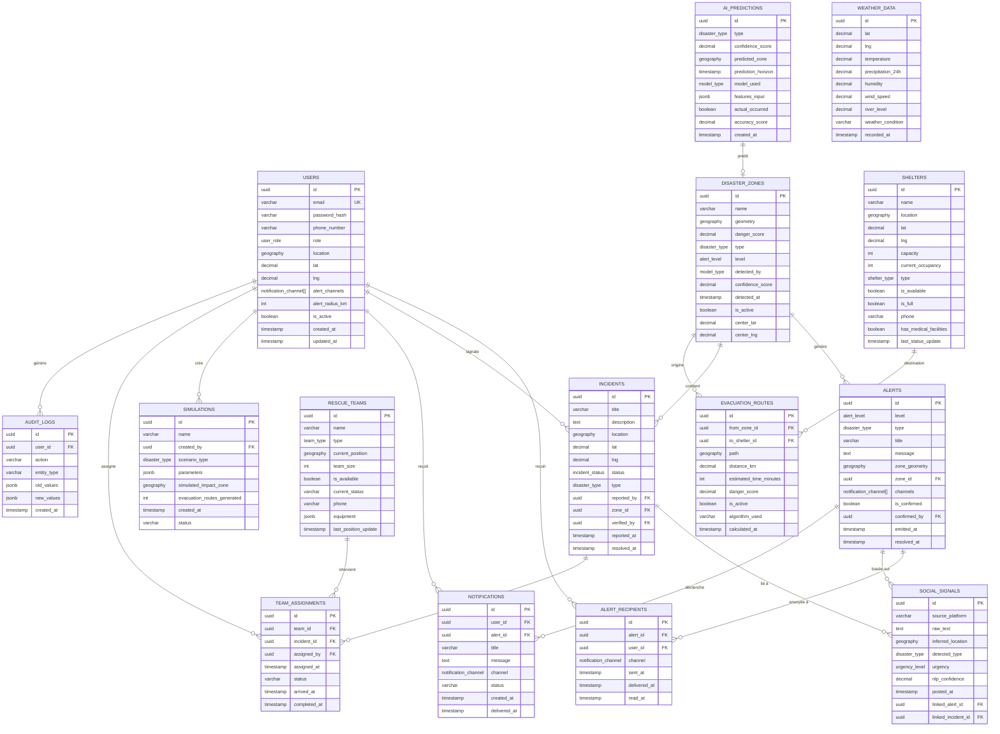

# 🗄️ MITANDRINA - Diagramme Entité-Relation (Database Schema)

## Diagramme ERD



---

## 📊 Types ENUM

| Type | Valeurs |
|------|---------|
| `user_role` | population, secouriste, administrateur |
| `disaster_type` | inondation, incendie, cyclone, seisme, glissement_terrain, tsunami |
| `alert_level` | info, vigilance, alerte, urgence |
| `incident_status` | signale, verifie, en_cours, resolu, archive |
| `shelter_type` | refuge, hopital, centre_urgence, abri_temporaire |
| `model_type` | xgboost, lstm, cnn, ridge_regression, bert |
| `urgency_level` | faible, moyenne, elevee, critique |
| `team_type` | pompier, police, medical, secouriste, militaire |
| `notification_channel` | sms, push, email, websocket, sirene |

---

## 🔗 Index Principaux

### Géospatiaux (GIST)
- `disaster_zones(geometry)`
- `incidents(location)`
- `shelters(location)`
- `evacuation_routes(path)`
- `ai_predictions(predicted_zone)`
- `social_signals(inferred_location)`
- `weather_data(location)`
- `users(location)`
- `rescue_teams(current_position)`

### Temporels
- `disaster_zones(detected_at DESC)`
- `alerts(emitted_at DESC)`
- `incidents(reported_at DESC)`
- `weather_data(recorded_at DESC)`

### Relations
- `alerts(zone_id)`
- `incidents(zone_id, reported_by)`
- `evacuation_routes(from_zone_id, to_shelter_id)`
- `social_signals(linked_alert_id)`

---

## 📁 Fichiers du Schéma

| Fichier | Description |
|---------|-------------|
| `/database/schema.sql` | Schéma complet PostgreSQL |
| `/database/ERD.md` | Ce diagramme ERD |

---

## 🚀 Commandes d'Initialisation

```bash
# Créer la base de données
createdb mitandrina

# Charger le schéma
psql -d mitandrina -f database/schema.sql

# Vérifier les tables
psql -d mitandrina -c "\dt"

# Vérifier les extensions PostGIS
psql -d mitandrina -c "SELECT PostGIS_Version();"
```
